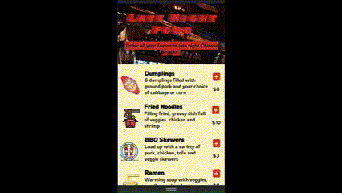
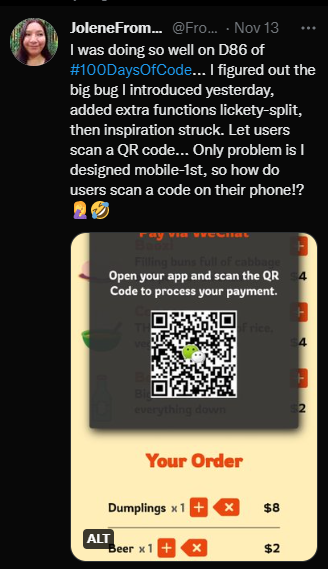
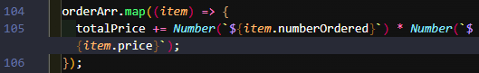
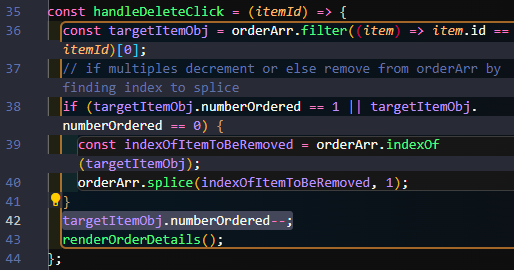
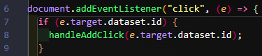
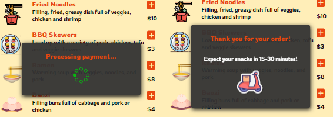
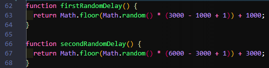

# Late Night Food

🔥 Visit the **[Live Site](https://late-night-food-ordering-app.vercel.app/)**!

<p>
   
   
   
   
   
   
</p>



I got the inspiration from **[Scrimba](https://scrimba.com/)**'s **Solo Project** to cap off their **Frontend Developer Career Path**'s **Module 5: Essential JavaScript**. For Scrimba Solo Projects, you are given requirements, optional stretch goals and a design, then need to figure it all out yourself.


<hr>

## 📜 Table of Contents

- [💪 My Motivation](https://github.com/JoleneKearse/Late-Night-Food-Ordering-App#-my-motivation)
- [🎯 MVP](https://github.com/JoleneKearse/Late-Night-Food-Ordering-App#-mvp)
- [✨ My Stretch Goals](https://github.com/JoleneKearse/Late-Night-Food-Ordering-App#-my-stretch-goals)
- [🎨 Design Choices](https://github.com/JoleneKearse/Late-Night-Food-Ordering-App#-design-choices)
- [🔄 My Process](https://github.com/JoleneKearse/Late-Night-Food-Ordering-App#-my-process)
  - [Memory Challenges 🧠](https://github.com/JoleneKearse/Late-Night-Food-Ordering-App#memory-challenges-)
    - [Collapsing Margins](https://github.com/JoleneKearse/Late-Night-Food-Ordering-App#collapsing-margins)
    - [Variables Can Help Us!](https://github.com/JoleneKearse/Late-Night-Food-Ordering-App#variables-can-help-us)
    - [Data Attributes](https://github.com/JoleneKearse/Late-Night-Food-Ordering-App#data-attributes)
  - [New Discoveries 🗺️](https://github.com/JoleneKearse/Late-Night-Food-Ordering-App#new-discoveries-%EF%B8%8F)
    - [`inputmode="numeric"`](https://github.com/JoleneKearse/Late-Night-Food-Ordering-App#inputmodenumeric)
    - [Random Delays for `setTimeout`](https://github.com/JoleneKearse/Late-Night-Food-Ordering-App#random-delays-for-settimeout)
- [🔖 Resources](https://github.com/JoleneKearse/Late-Night-Food-Ordering-App#-resources)

<hr>

## 💪 My Motivation

[Back to Table of Contents](https://github.com/JoleneKearse/Late-Night-Food-Ordering-App#table-of-contents)

The design looked cool, but I'm not really a hamburger 🍔 kind of girl. So I got to thinking... _'What kind of food would make me super excited?'_ 🤔

Well, I miss tons of things from living in China for 15 years... Especially stopping for a chill late night dinner after teaching until 9 p.m., then commuting 1 hour plus back to my neighbourhood. 😅

China has restaurants everywhere and a vibrant late night food scene. Food stalls on the side of streets stay open until 5 in the morning!


But what about those times you just want to head home with tasty treats? 🥡

In comes my app! 📱 When you're close to home, simply place your order, get into your comfies, and have your late night snack brought to your door!

## 🎯 MVP

[Back to Table of Contents](https://github.com/JoleneKearse/Late-Night-Food-Ordering-App#table-of-contents)

I had already thrown out the **design spec**, but there were certain things I felt were must haves:

- Rendering the **menu** 🍜 with JavaScript including the name, description, price and an Add button.
- Working Add ➕ buttons
- Bill information that would pop up only when something was added
- Ability to remove ➖ items when desired
- Allowing users to order multiples of items
- Total price to be displayed
- Ability to Place Order
- Payment Modal

## ✨ My Stretch Goals

**Late Night Food** being a Chinese food ordering app got me thinking about the **Payment Modal**...

In China, _everyone_ uses [WeChat](https://www.wechat.com/), which is a **super app** - _like what Elon Musk talks about transforming **Twitter** into_. It's one app to talk with your friends in chat, voice and video, view people's posts and news, play games, and, drum roll 🥁, **make payments**.

So, of course, I had to use WeChat to pay, right?!

I ran into one issue... I coded it **mobile-first** and initially added the method I remember seeing most often - people using their phones to **scan a QR code**. But if they were using their phone to order, what good was a QR code on their phone to scan with said phone? LOL



Obviously I had to consider some more features:

- media queries in JavaScript to show the QR code for tablet or desktop, then something else for mobile...

- how to process the order on mobile

- automatically move the focus to the next input box

- simulate the payment being processed (_because I'd already gone this far_)

- randomize the 'processing times' in the payment modal

## 🎨 Design Choices

[Back to Table of Contents](https://github.com/JoleneKearse/Late-Night-Food-Ordering-App#table-of-contents)

Of course this was the most difficult part! 🤣 First up I choose the food images.

I liked how the **Scrimba** design used emojis, but a search didn't yield the variety I wanted...

I considered using **jpg**'s, but decided I wanted a **cleaner UI**...

So I searched for icons, and, wow, did [Icons8](https://icons8.com/) really deliver! They had a great free collection and you could even use **CDN**'s!

Then I went on an exhaustive search for Asian-looking Google Fonts. I kept ending up with Chinese-language ones! 🤣 But I really liked **[Faster One](https://fonts.google.com/specimen/Faster+One?query=faster+one)** for the **title** as it suggested speed to me.


I also went through multiple **header** images. One where I took my **accent colour** from a Chinese lantern, but I ultimately ended up going with with this cool Chinese roof image.

## 🔄 My Process

[Back to Table of Contents](https://github.com/JoleneKearse/Late-Night-Food-Ordering-App#table-of-contents)

After cracking the **design process**, which I absolutely love ❤️, but can certainly take up time, I was ready to go! 🏎️

I'm breaking this section up into two parts:

- things I knew but needed reminders about, either through Googling or referring to past projects, &

- shiny new things I learned.

### Memory Challenges 🧠

[Back to Table of Contents](https://github.com/JoleneKearse/Late-Night-Food-Ordering-App#table-of-contents)

#### Collapsing Margins

[Back to Table of Contents](https://github.com/JoleneKearse/Late-Night-Food-Ordering-App#-table-of-contents)

I have been lucky to not have to deal with this much, but maybe too lucky as I had forgotten how to fix it! 😉

Originally my header image had a big margin above it. And I couldn't remember what to Google to find the solution. After much, much, _much_ searching I found this fix.

```css
.container {
  overflow: auto;
}
header {
  padding: 1px;
}
```

#### Variables Can Help Us!

[Back to Table of Contents](https://github.com/JoleneKearse/Late-Night-Food-Ordering-App#-table-of-contents)

After getting the initial `totalPrice` displayed for user's orders, I was a tad puzzled on how to let them order **multiples of menu items**.

Happily I wasn't completely dense and added a new `numberOrdered` variable to my `menuArr`.


This allows a simple expression to be run when generating the Bill.



> The need to use `Number()` tickles my curiousity about **TypeScript** - so much to learn! ❤️

It also made **deleting items** easier as I could just **decrement** them.



#### Data Attributes

[Back to Table of Contents](https://github.com/JoleneKearse/Late-Night-Food-Ordering-App#-table-of-contents)

I had settled 7 menu items 🥟 (_only limited by which images to could easily find with a CDN_) each with an Add Button, so I thought what a great use for **data attributes**!

I first put the `data-id` on each button. This **customizable** attribute let's you store any data you want, in this case the menu item's id.

I then set up the **click event listener** to listen for a click on that particular element.



### New Discoveries 🗺️

[Back to Table of Contents](https://github.com/JoleneKearse/Late-Night-Food-Ordering-App#-table-of-contents)

#### `inputmode="numeric"`

I did not care for the look of the **spinbuttons** - those up and down arrows next to a number field. These come out of the box when you write: `<input type="number"`. I couldn't remember how to _style them out of the page_, but just a little bit of research led me to `inputmode="numeric"`.

This will still bring up a mobile device's numeric keyboard, but without that pesky spinbutton messing with your design!

Also [MDN](https://developer.mozilla.org/en-US/docs/Web/HTML/Element/input/number) notes:

> "The number input type should only be used for **incremental numbers**, especially when spinbutton incrementing and decrementing are helpful to user experience."

#### Random Delays for `setTimeout`

Since I went through the effort of showing WeChat payments, I wanted to **simulate the payment processing**. I have a processing and completed screen.



Originally I had the set to go off at `3000` and `6000` milliseconds a piece, but who wants predictable? 😁

So I wrote up a `randomDelay` function, which led to some weird results like the confirmation appearing before the processing screen!

_What?!?_ Oh, yes, the time delays need to be staggered! 🤦‍♀️

The logical solution was two delay functions:



#### Automatically Moving to the Next Input Box

This was my nemesis! 🤯 Although I completed all my MVP's and nearly all my stretch goals, I could not call this project complete until I got this to obey!

With a little research, I found WeChat uses a 6-digit password to pay on mobile (rather than a QR code to scan). I styled up this realistic interface and it was working.


But I couldn't tolerate making my hypothetical users manually move to the next input box - _the horror, right?!_

## 🔖 Resources

[Back to Table of Contents](https://github.com/JoleneKearse/Late-Night-Food-Ordering-App#table-of-contents)

- [Icons8](https://icons8.com/) for my small food icons
- ['Faster One' Google Font](https://fonts.google.com/specimen/Faster+One?query=faster+one)
- [Working with JavaScript Media Queries](https://css-tricks.com/working-with-javascript-media-queries/)
