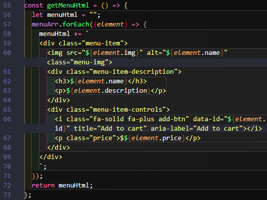
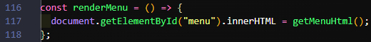

# Late Night Food

Visit the **[Live site]()**!

<p>
   
   
   
   
   
   
</p>


I got the inspiration from **[Scrimba](https://scrimba.com/)**'s **Solo Project** to cap off their **Frontend Developer Career Path**'s **Module 5: Essential JavaScript**.


## Table of Contents

- [My Motivation](https://github.com/JoleneKearse/Late-Night-Food-Ordering-App#my-motivation)
- [MVP](https://github.com/JoleneKearse/Late-Night-Food-Ordering-App#mvp)
- [Design Choices](https://github.com/JoleneKearse/Late-Night-Food-Ordering-App#design-choices)
- [My Process](https://github.com/JoleneKearse/Late-Night-Food-Ordering-App#my-process)
  - [Data](https://github.com/JoleneKearse/Late-Night-Food-Ordering-App#data)
  - [Set up the Header]()
  - [Generate the Menu via JavaScript]()
  - [Data Attributes](https://github.com/JoleneKearse/Late-Night-Food-Ordering-App#data-attributes)
  - [Function: `handleAddClick`]()
- [Resources](https://github.com/JoleneKearse/Late-Night-Food-Ordering-App#resources)

## My Motivation

[contents](https://github.com/JoleneKearse/Late-Night-Food-Ordering-App#table-of-contents)

It sounded cool, but I'm not really a hamburger kind of girl. 🍔 So I got to thinking... _'What kind of food would make me super excited?'_ 🤔

Well, I miss tons of things from living in China for 15 years... Especially stopping for a chill late night dinner after teaching until 9 p.m., then commuting 1 hour plus back to my neighbourhood. 😅

China has restaurants everywhere and a vibrant late night food scene. Even food stalls on the side of streets open until 5 in the morning!


But what about those times you just want to head home with tasty treats? 🥡

In comes my app! 📱 When you're close to home, simply place your order, get into your comfies, and have your late night snack brought to your door!

## MVP

[contents](https://github.com/JoleneKearse/Late-Night-Food-Ordering-App#table-of-contents)

I had already thrown out the **design spec**, but there were certain things I felt were must haves:

- Rendering the **menu** 🍜 with JavaScript including the name, description, price and an Add button.
- Working Add ➕ buttons
- Bill information that would pop up only when something was added
- Ability to remove ➖ items when desired
- Allowing users to order multiples of items
- Total price to be displayed
- Ability to Place Order
- Payment Modal

## Design Choices

[contents](https://github.com/JoleneKearse/Late-Night-Food-Ordering-App#table-of-contents)

Of course this was the most difficult part! 🤣 First up I choose the food images.

I liked how the **Scrimba** design used emojis, but a search didn't yield the variety I wanted...

I considered using **jpg**'s, but decided I wanted a cleaner UI...

So I searched for icons, and, wow, did [Icons8](https://icons8.com/) really deliver! They had a great free collection and you could even use **CDN**'s!

Then I went on an exhaustive search for Asian-looking Google Fonts. I kept ending up with Chinese-language ones! 🤣 But I really liked **[Faster One](https://fonts.google.com/specimen/Faster+One?query=faster+one)** for the **title** as it suggested speed to me.

I also went through multiple **header** images. One where I took my **accent colour** from a Chinese lantern, but I ultimately ended up going with with this cool Chinese roof image.

## My Process

[contents](https://github.com/JoleneKearse/Late-Night-Food-Ordering-App#table-of-contents)

After cracking the **design process**, which I absolutely love ❤️, but can certainly take up time, I was ready to go! 🏎️

1. ### Data

[contents](https://github.com/JoleneKearse/Late-Night-Food-Ordering-App#table-of-contents)

After, of course, setting up the HTML, this was my first stop. I had to consider which menu items to include. Then which properties I'd add.


> The numberOrdered property came later, when I considered the logic behind allowing a customer to order more than one of a menu item.

2. ## Set up the Header

[contents](https://github.com/JoleneKearse/Late-Night-Food-Ordering-App#table-of-contents)

This was the static section of the site, set up in within the HTML file.

i. I set up the container to hold everything in the middle of the page. Then applied the following styles for a **mobile-first** workflow:

```css
.container {
  width: min(100%, 90em);
  margin-inline: auto;
}
```

ii. I wanted the `header` to be sufficiently big to hold my `h1` and `tagline` and set the mood for the app, so I set it's height to `12em`.

iii. I _actually_ had to remember how to deal with the **collapsing margin**!

```css
.container {
  overflow: auto;
}
header {
  padding: 1px;
}
```

3. ## Generate the Menu via JavaScript

[contents](https://github.com/JoleneKearse/Late-Night-Food-Ordering-App#table-of-contents)

i. I use **semantic HTML** tags as much as possible within that file. So I have a `main` tag to enclose the Menu and Order Details sections.

ii. I originally set the menu up in a `section` until I remembered all the buttons it would hold! So I went with a `form` tag with and `id` to grab with JavaScript.

```html
<form id="menu"></form>
```

iii. In a first function, I run a `.forEach()` over the `menuArr` from `data.js` to create the HTML. Here I thought about which `div`s & `class`es I'd need for styling purposes. I also included **alt text** for the image using `element.name`, and added `aria-label="Add to cart"` to the button icons.



iv. I call that the `getMenuHtml` function:



v. I style it up. The biggest thing I did was use **CSS Grid** rather than **Flexbox**, my go-to. I wanted it to be more of a table, or, uhm, grid, format, so the content-first layout tool was of less use here.

4. ### Data Attributes

[contents](https://github.com/JoleneKearse/Late-Night-Food-Ordering-App#table-of-contents)

I had 7 menu items each with an Add Button, so I thought what a great use for **data attributes**?

i. I first put the `data-id` on each button. You can see it's use in the `getMenuHtml` function above on _line 66_. This **customizable** attribute let's you store any data you want.

ii. I set up the **click event listener** to listen for a click on that particular element.


5. ### Function: `handleAddClick`

[contents](https://github.com/JoleneKearse/Late-Night-Food-Ordering-App#table-of-contents)

> I experimented with placing the site functions in another file, but found it was much easier to keep them in `index.js` if only for the global `orderArr` variable.

## Resources

[contents](https://github.com/JoleneKearse/Late-Night-Food-Ordering-App#table-of-contents)

- [Icons8](https://icons8.com/) for small my food icons
- ['Faster One' Google Font](https://fonts.google.com/specimen/Faster+One?query=faster+one)
